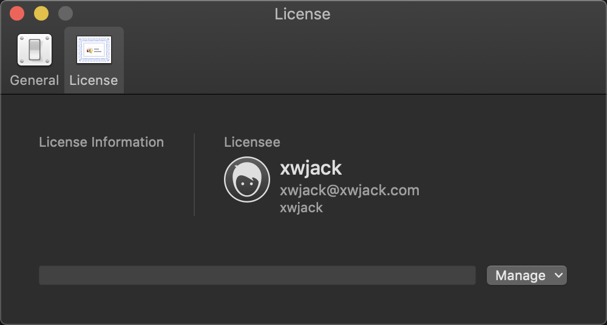
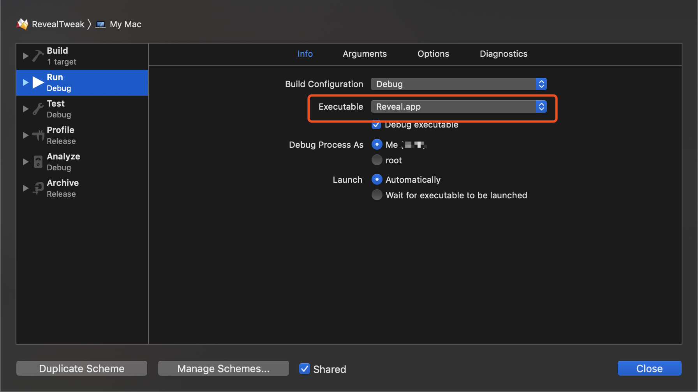

# Reveal

Version: 20(11340)

## Success Platform

Xcode Version 10.1 (10B61)
MacOS 10.14.3

# Usage

Drag **Reveal/Resources/Reveal.app** to **Application**.

# Develop

1. Modify bundle id.
2. Modify executable with `Reveal.app` path. 

# Problem

- [ ] Windows bar button enable. 

# MIT License

